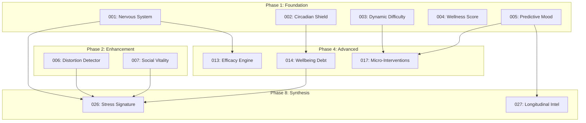

# MindFriend Feature Specifications Index

> **Version:** 3.0.0 (Reordered by Implementation Priority)
> **Last Updated:** 2026-01-22
> **Total Features:** 27
> **Novel Differentiators:** 7 (marked with ⭐)

---

## Implementation Order

Specs are numbered 001-027 in optimal implementation order based on:

1. **Dependencies** - Foundation features first
2. **Value Delivery** - Novel differentiators interspersed for early competitive advantage
3. **Complexity Progression** - Simpler → Advanced

---

## Feature Catalog

| #   | File                                                                                               | Feature                                 | Type     | Phase       |
| --- | -------------------------------------------------------------------------------------------------- | --------------------------------------- | -------- | ----------- |
| 001 | [001-nervous-system-state-engine.md](./001-nervous-system-state-engine.md)                         | Nervous System State Engine             | ⭐ NOVEL | Foundation  |
| 002 | [002-circadian-vulnerability-shield.md](./002-circadian-vulnerability-shield.md)                   | Circadian Vulnerability Shield          | ⭐ NOVEL | Foundation  |
| 003 | [003-dynamic-difficulty-adjustment.md](./003-dynamic-difficulty-adjustment.md)                     | Dynamic Difficulty Adjustment           | Standard | Foundation  |
| 004 | [004-daily-wellness-score.md](./004-daily-wellness-score.md)                                       | Daily Wellness Score                    | Standard | Foundation  |
| 005 | [005-predictive-mood-intelligence.md](./005-predictive-mood-intelligence.md)                       | Predictive Mood Intelligence            | MOONSHOT | Foundation  |
| 006 | [006-cognitive-distortion-detector.md](./006-cognitive-distortion-detector.md)                     | Cognitive Distortion Detector           | ⭐ NOVEL | Enhancement |
| 007 | [007-social-vitality-index.md](./007-social-vitality-index.md)                                     | Social Vitality Index                   | ⭐ NOVEL | Enhancement |
| 008 | [008-progress-narrative.md](./008-progress-narrative.md)                                           | Progress Narrative                      | Standard | Engagement  |
| 009 | [009-streak-shields-enhancement.md](./009-streak-shields-enhancement.md)                           | Streak Shields Enhancement              | Standard | Engagement  |
| 010 | [010-achievement-milestones.md](./010-achievement-milestones.md)                                   | Achievement Milestones                  | Standard | Engagement  |
| 011 | [011-personalized-daily-briefing.md](./011-personalized-daily-briefing.md)                         | Personalized Daily Briefing             | Standard | Engagement  |
| 012 | [012-wellness-time-capsule.md](./012-wellness-time-capsule.md)                                     | Wellness Time Capsule                   | Standard | Engagement  |
| 013 | [013-intervention-efficacy-engine.md](./013-intervention-efficacy-engine.md)                       | Intervention Efficacy Engine            | ⭐ NOVEL | Advanced    |
| 014 | [014-wellbeing-debt-calculator.md](./014-wellbeing-debt-calculator.md)                             | Wellbeing Debt Calculator               | ⭐ NOVEL | Advanced    |
| 015 | [015-sleep-optimization-system.md](./015-sleep-optimization-system.md)                             | Sleep Optimization System               | Standard | Content     |
| 016 | [016-ai-generated-exercises.md](./016-ai-generated-exercises.md)                                   | AI-Generated Exercises                  | Standard | Content     |
| 017 | [017-contextual-micro-interventions.md](./017-contextual-micro-interventions.md)                   | Contextual Micro-Interventions          | Standard | Content     |
| 018 | [018-life-transition-pathways.md](./018-life-transition-pathways.md)                               | Life Transition Pathways                | Standard | Life        |
| 019 | [019-mentorship-matching.md](./019-mentorship-matching.md)                                         | Mentorship Matching                     | MOONSHOT | Social      |
| 020 | [020-community-wisdom-engine.md](./020-community-wisdom-engine.md)                                 | Community Wisdom Engine                 | MOONSHOT | Social      |
| 021 | [021-ambient-wellness-presence.md](./021-ambient-wellness-presence.md)                             | Ambient Wellness Presence               | MOONSHOT | Platform    |
| 022 | [022-ar-grounding-exercises.md](./022-ar-grounding-exercises.md)                                   | AR Grounding Exercises                  | MOONSHOT | Platform    |
| 023 | [023-biofeedback-adaptation.md](./023-biofeedback-adaptation.md)                                   | Biofeedback Adaptation                  | MOONSHOT | Platform    |
| 024 | [024-autonomous-wellness-agent.md](./024-autonomous-wellness-agent.md)                             | Autonomous Wellness Agent               | MOONSHOT | Autonomous  |
| 025 | [025-generative-wellness-experiences.md](./025-generative-wellness-experiences.md)                 | Generative Wellness Experiences         | MOONSHOT | Autonomous  |
| 026 | [026-stress-signature-fingerprint.md](./026-stress-signature-fingerprint.md)                       | Stress Signature Fingerprint            | ⭐ NOVEL | Synthesis   |
| 027 | [027-longitudinal-mental-health-intelligence.md](./027-longitudinal-mental-health-intelligence.md) | Longitudinal Mental Health Intelligence | MOONSHOT | Synthesis   |

---

## Phase Breakdown

### Phase 1: Foundation (001-005)

Build core sensing and prediction capabilities.

| #   | Feature                        | Why First               |
| --- | ------------------------------ | ----------------------- |
| 001 | Nervous System State Engine    | Foundation for 013, 026 |
| 002 | Circadian Vulnerability Shield | Foundation for 014      |
| 003 | Dynamic Difficulty Adjustment  | Foundation for 017, 018 |
| 004 | Daily Wellness Score           | User-facing metric      |
| 005 | Predictive Mood Intelligence   | ML prediction layer     |

### Phase 2: Enhancement (006-007)

Add intelligence to existing features.

| #   | Feature                       | Enhances         |
| --- | ----------------------------- | ---------------- |
| 006 | Cognitive Distortion Detector | Voice journaling |
| 007 | Social Vitality Index         | Circles          |

### Phase 3: Engagement (008-012)

Deepen user engagement and retention.

| #   | Feature                     | Value                |
| --- | --------------------------- | -------------------- |
| 008 | Progress Narrative          | Storytelling         |
| 009 | Streak Shields              | Protection           |
| 010 | Achievement Milestones      | Gamification         |
| 011 | Personalized Daily Briefing | Daily touchpoint     |
| 012 | Wellness Time Capsule       | Long-term connection |

### Phase 4: Advanced (013-017)

Build on novel foundations.

| #   | Feature                        | Depends On          |
| --- | ------------------------------ | ------------------- |
| 013 | Intervention Efficacy Engine   | 001                 |
| 014 | Wellbeing Debt Calculator      | 002                 |
| 015 | Sleep Optimization System      | Existing biometrics |
| 016 | AI-Generated Exercises         | Existing content    |
| 017 | Contextual Micro-Interventions | 003, 005            |

### Phase 5: Life & Social (018-020)

Expand to life events and community.

| #   | Feature                  | Scope                   |
| --- | ------------------------ | ----------------------- |
| 018 | Life Transition Pathways | Life events             |
| 019 | Mentorship Matching      | Peer support            |
| 020 | Community Wisdom Engine  | Collective intelligence |

### Phase 6: Platform (021-023)

Multi-platform and immersive.

| #   | Feature                   | Platform                |
| --- | ------------------------- | ----------------------- |
| 021 | Ambient Wellness Presence | Widgets, Watch, CarPlay |
| 022 | AR Grounding Exercises    | ARKit                   |
| 023 | Biofeedback Adaptation    | Real-time HRV loop      |

### Phase 7: Autonomous (024-025)

Industry-defining autonomous features.

| #   | Feature                         | Capability         |
| --- | ------------------------------- | ------------------ |
| 024 | Autonomous Wellness Agent       | Proactive AI       |
| 025 | Generative Wellness Experiences | Personalized audio |

### Phase 8: Synthesis (026-027)

Integrate all signals for ultimate prediction.

| #   | Feature                                 | Synthesizes         |
| --- | --------------------------------------- | ------------------- |
| 026 | Stress Signature Fingerprint            | 001, 006, 007, 014  |
| 027 | Longitudinal Mental Health Intelligence | All historical data |

---

## Dependency Graph

---

## Novel Differentiators Summary

These 7 features (⭐) have NO equivalent in competitor apps:

| #   | Feature                        | Scientific Basis    | Competitive Moat                  |
| --- | ------------------------------ | ------------------- | --------------------------------- |
| 001 | Nervous System State Engine    | Polyvagal Theory    | First consumer polyvagal sensing  |
| 002 | Circadian Vulnerability Shield | Chronobiology       | Chronotype-aware prevention       |
| 006 | Cognitive Distortion Detector  | CBT                 | Real-time CBT during voice        |
| 007 | Social Vitality Index          | Social Contagion    | Predictive withdrawal detection   |
| 013 | Intervention Efficacy Engine   | N-of-1 Trials       | Track trajectory DURING exercises |
| 014 | Wellbeing Debt Calculator      | Allostatic Load     | Cumulative stress modeling        |
| 026 | Stress Signature Fingerprint   | Prodromal Detection | Personalized early warning        |

---

## Implementation Guidelines

### Coding Standards

- Follow existing patterns in `apps/ios/MindFriendApp/`
- Use SwiftUI for all new views
- Use async/await for all asynchronous operations
- Follow MVVM architecture with ViewModels
- All new services added to `DependencyContainer`

### Database Conventions

- All new tables require RLS policies
- Use `timestamptz` for all timestamps
- Include `created_at` and `updated_at` on all tables
- Foreign keys reference `auth.users(id)` for user_id

### Edge Function Conventions

- All functions in `supabase/functions/`
- Use Zod for input validation
- Return structured JSON with error codes
- Log to `console.log` for observability

### Testing Requirements

- Unit tests for all ViewModels
- Integration tests for Edge Functions
- Minimum 80% code coverage for new features
